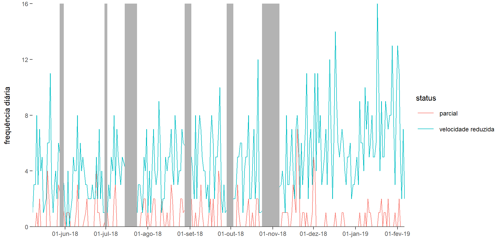
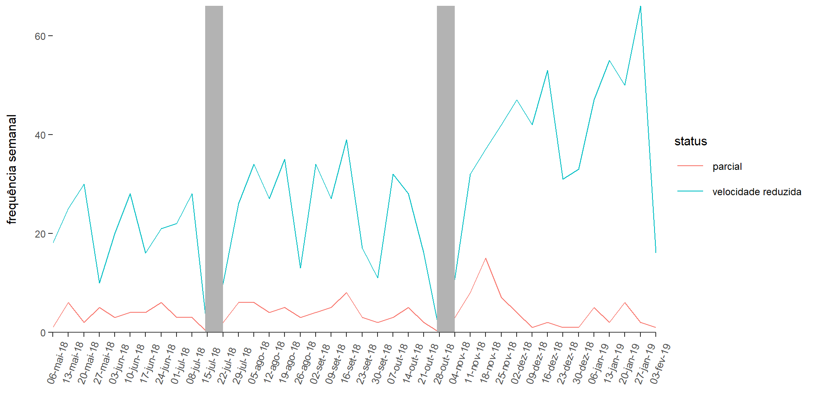
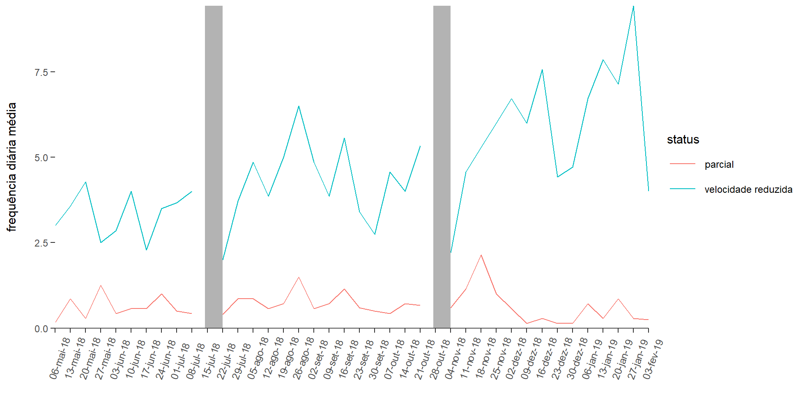
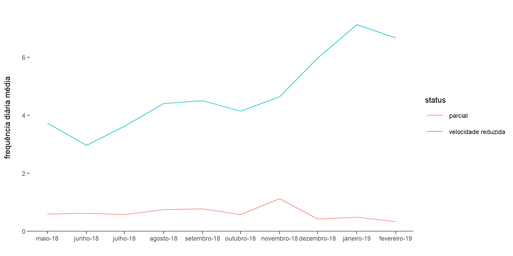
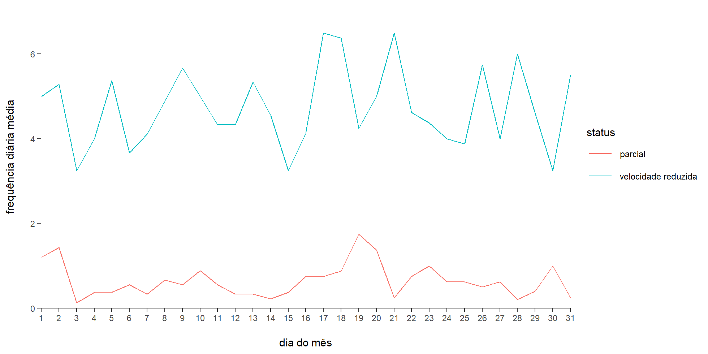
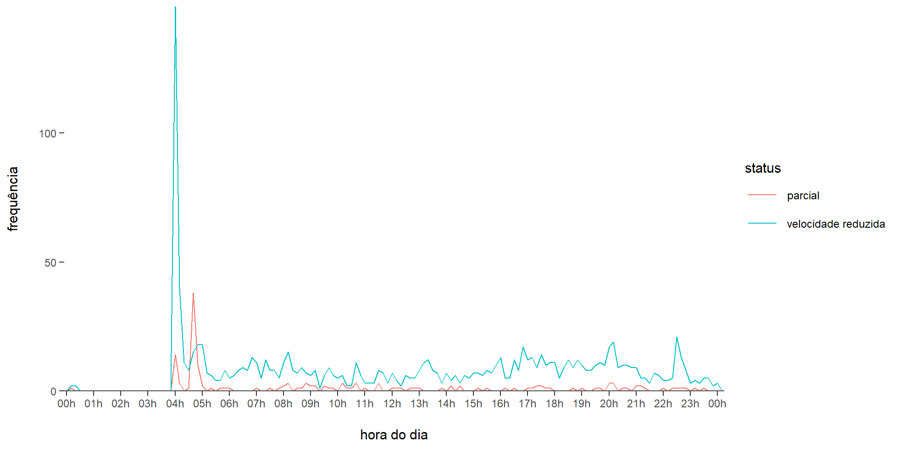
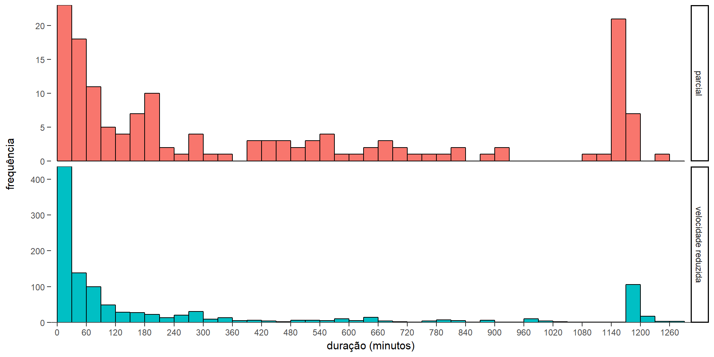

**Como anda o metrô de São Paulo?**
================

------------------------------------------------------------------------


Introdução
----------

O metrô e trens de São Paulo são dois dos meios de transporte mais usados pelos paulistanos. Como muitos paulistanos sabem, metrô e trens estão sujeitos à falhas de operação. E quando estas falhas acontecem, o transtorno para os usuários pode ser enorme. Assim, seria muito interessante que os passageiros tivessem acesso aos dados destas falhas, pois a análise destas ocorrências poderia gerar informações úteis para os usuários do sistema. No entanto, como bem relatado pelo **Douglas Navarro** em seu post [*Building a dataset for the São Paulo Subway operation*](https://towardsdatascience.com/building-a-dataset-for-the-s%C3%A3o-paulo-subway-operation-2d8c5a430688), o metrô de São Paulo não disponibiliza muitos dados sobre estas falhas. É justamente isso que o Douglas tentou remediar, criando um *scraper* para coletar e armazenar dados sobre estas falhas.

Aproveitando que o Douglas gentimente disponibilizou no GitHub [um repositório](https://github.com/douglasnavarro/sp-subway-scraper) para a comunidade analisar os dados gerados pela ferramenta, realizei uma análise exploratória básica em busca de padrões úteis para os usuários. Este *R notebook* apresenta os resultados destas análises.

> Esta é minha primeira experiência com *R notebooks*, e com a análise de dados deste tipo. Assim, uma boa parte do *notebook* é usada para explicar os tratamentos aplicados aos dados antes das análises. Espero que achem interessante... sugestões são muito bem vindas!

------------------------------------------------------------------------

Coleta dos dados
----------------

Conforme mencionado, os dados utilizados nesta análise são o resultado de um *scraper* escrito pelo **Douglas Navarro** em Python. Para aqueles que nunca notaram, o [site da concessionária da Linha Amarela](http://www.viaquatro.com.br/) disponibiliza o status do funcionamento de todas as linhas da rede ferroviária da região metropolitana de São Paulo. O *scraper* consulta o site a cada 6 minutos e registra o status de todas as linhas. Os dados são então salvos em planilhas mensais no Google Drive. Para aqueles que queiram mais informações de como funciona o *scraper*, recomendo demais a leitura do post indicado na introdução.

> Os dados usados nesta análise contemplam o período entre maio de 2018 e fevereiro de 2019

O primeiro passo para a obtenção dos dados é então buscá-los na internet. Para isso, usamos as bibliotecas `googledrive` e `gsheet`. Além disso, vamos usar o `dplyr` para unir as diferentes tabelas em um conjunto de dados único:

``` r
library(googledrive)
library(gsheet)
library(dplyr)
```

Para a coleta de dados, indicamos a pasta do Google Drive onde estão as planilhas com os dados mensais. Usando as funções dos pacotes que acabamos de carregar, obtemos uma lista com os arquivos disponíveis na pasta:

``` r
drive_folder <- 'https://drive.google.com/drive/folders/1vXVWAJHnpvW9UaNSybqdEPZ8EaXIVYGF?usp=sharing'
subway_files <- drive_ls(path = as_id(drive_folder))
```

Aqui é importante notar que é preciso autenticar o acesso da biblioteca `googledrive` a pasta indicada pelo link. Depois que é gerada pela primeira vez, é possível salvar a chave de autenticação junto deste *notebook*, de forma que o processo passa a ser feito automaticamente. A mensagem acima confirma que o procedimento foi realizado com sucesso.

Com a lista de arquivos, extraímos a URL de cada planilha e fazemos a leitura e download dos dados. Usando `union_all`, nós criamos um *data frame* único - `subway` - com todos os dados disponíveis:

``` r
i <- 1
subway_urls <- c()
for (file in subway_files$drive_resource){
  subway_urls[[i]] <- file[[11]]
  i <- i + 1
}

subway <- data.frame()
for (url in subway_urls) {
  # Import Google Sheet as text (to avoid introducing 'NAs')
  raw_metro <- gsheet2text(url = url, format = 'csv', sheetid = NULL)
  metro <- read.csv(text = raw_metro, header = FALSE, stringsAsFactors = FALSE)
  subway <- dplyr::union_all(subway, metro)
}

remove(drive_folder, subway_files, i, subway_urls, file, url, raw_metro, metro)
```

------------------------------------------------------------------------

Limpeza dos dados
-----------------

Como é usual antes de iniciar uma análise, é preciso **verificar a integridade e qualidade dos dados**. Caso sejam notadas inconsistências, então é necessário realizar uma limpeza. Na sua forma bruta, os dados estão assim:

``` r
head(subway)
```

    ##                 V1       V2              V3
    ## 1 03/02/2019 15:43     azul                
    ## 2 03/02/2019 15:43    verde                
    ## 3 03/02/2019 15:43 vermelha                
    ## 4 03/02/2019 15:43  amarela Operação Normal
    ## 5 03/02/2019 15:43    lilás          normal
    ## 6 03/02/2019 15:43    prata

Como é possível observar, os dados são constituídos de 3 variáveis: **data e hora da captura do status**, a **linha** do metrô ou trem e o seu **status de operação**. No momento, as variáveis estão sem nome, e todas estão armazenadas como caracteres (`chr`). Desta forma, vamos começar a limpeza dos dados pelas colunas, sem esquecer de antes carregar as demais bibliotecas usadas nas análises:

``` r
library(tidyr)
library(lubridate)
library(ggplot2)
```

### *Limpeza das colunas*

Vamos nomear as variáveis, e definir a classe de data e hora como `POSIXct`, um tipo de formato de tempo:

``` r
colnames(subway) <- c('date_time', 'line', 'status')
subway$date_time <- as.POSIXct(x = subway$date_time, tz = 'America/Sao_Paulo', format = '%d/%m/%Y %H:%M')
```

Os dados agora estão assim:

    ##             date_time     line          status
    ## 1 2019-02-03 15:43:00     azul                
    ## 2 2019-02-03 15:43:00    verde                
    ## 3 2019-02-03 15:43:00 vermelha                
    ## 4 2019-02-03 15:43:00  amarela Operação Normal
    ## 5 2019-02-03 15:43:00    lilás          normal
    ## 6 2019-02-03 15:43:00    prata

O próximo passo é verificar se os valores registrados na variável `line` estão padronizados:

``` r
table(subway$line, useNA = 'ifany')
```

    ## 
    ##   amarela      azul     coral  diamante esmeralda      jade     lilas 
    ##     55672     55683     55650     55657     55656     40135     15520 
    ##     lilás     prata      rubi    safira  turquesa     verde  vermelha 
    ##     40151     55670     55659     55650     55653     55678     55676

É possível notar que os nomes das linhas de trem estão padronizados, com exceção da **Linha Lilás**, que aparece com acento e sem ele. Vamos padronizar para a versão sem acento:

``` r
subway$line[subway$line == 'lilás'] <- 'lilas'
```

Vamos verificar agora os valores armazenados na variável `status`:

``` r
table(subway$status, useNA = 'ifany')
```

    ## 
    ##                         dados indisponíveis                normal 
    ##                  5232                     7                487812 
    ## Operação Diferenciada    operação encerrada    Operação Encerrada 
    ##                    31                110040                 10404 
    ##       operação normal       Operação Normal   Operação Paralisada 
    ##                    89                 31881                   658 
    ##      operação parcial      Operação Parcial  operações encerradas 
    ##                  3928                    23                  1433 
    ##            paralisada   velocidade reduzida   Velocidade Reduzida 
    ##                  6576                 49938                    58

Podemos observar que existem **15 valores** distintos para `status`. No entanto, vários deles representam variações do mesmo status, com pequenas diferenças tais como letras maiúsculas, uso do plural, omissão da palavra 'operação', etc. Vamos padronizar a nomenclatura usando as seguintes convenções:

-   apenas letras minúsculas
-   expressão no singular
-   omissão da palavra 'operação'
-   dados em branco e indisponíveis serão agrupados como **no data**

Além disso, não foram encontradas as definições formais do que seriam os status **paralisada** e **parcial**, mas consultando as descrições de alguns dos eventos disponíveis neste [site](https://www.diretodostrens.com.br/), aparentemente se tratam do mesmo tipo de ocorrência, isto é, quando algumas das estações da linha estão fechadas. Já o termo **Operação diferenciada** é usado apenas pela **Linha Amarela**. Em geral, o uso deste status também está associado à estações fechadas, embora às vezes signifique apenas velocidade reduzida. Considerando as similaridades, vamos agrupar todos estes eventos sob o termo **parcial**.

``` r
subway$status <- tolower(subway$status)
subway$status <- gsub(pattern = 'operações encerradas', replacement = 'operação encerrada', x = subway$status)
subway$status <- gsub(pattern = 'operação ', replacement = '', x = subway$status)
subway$status <- gsub(pattern = 'paralisada|diferenciada', replacement = 'parcial', x = subway$status)
subway$status[subway$status == 'dados indisponíveis'] <- ''
subway$status[subway$status == ''] <- 'no data'
```

Agora os domínios das variáveis `line` e `status` estão padronizados:

``` r
summary(sapply(subway[ ,2:3], as.factor), maxsum = 20)
```

    ##         line                       status      
    ##  amarela  :55672   encerrada          :121877  
    ##  azul     :55683   no data            :  5239  
    ##  coral    :55650   normal             :519782  
    ##  diamante :55657   parcial            : 11216  
    ##  esmeralda:55656   velocidade reduzida: 49996  
    ##  jade     :40135                               
    ##  lilas    :55671                               
    ##  prata    :55670                               
    ##  rubi     :55659                               
    ##  safira   :55650                               
    ##  turquesa :55653                               
    ##  verde    :55678                               
    ##  vermelha :55676

### *Limpeza das linhas*

Agora que as variáveis estão limpas, é preciso procurar por **inconsistências entre as diferentes linhas do conjunto de dados**. O primeiro passo nesta etapa é ordenar os registros de eventos por linha do metrô e ordem cronológica, e depois agrupá-los por linha do metrô:

``` r
subway <- subway %>% arrange(line, date_time) %>% group_by(line)
head(subway)
```

    ## # A tibble: 6 x 3
    ## # Groups:   line [1]
    ##   date_time           line    status
    ##   <dttm>              <chr>   <chr> 
    ## 1 2018-05-07 23:45:00 amarela normal
    ## 2 2018-05-08 15:59:00 amarela normal
    ## 3 2018-05-08 16:01:00 amarela normal
    ## 4 2018-05-08 16:29:00 amarela normal
    ## 5 2018-05-08 16:42:00 amarela normal
    ## 6 2018-05-08 16:53:00 amarela normal

Uma variável que será muito importante em qualquer análise que fizermos é a **duração em segundos de cada um dos eventos registrados**, `interval_sec`. Note que como os eventos estão ordenados e agrupados por linha do metrô, apenas precisamos calcular a diferença entre a data de um registro e a data do registro seguinte. Temos então:

``` r
subway <- mutate(subway, interval_sec = dplyr::lead(date_time) - date_time)
head(subway)
```

    ## # A tibble: 6 x 4
    ## # Groups:   line [1]
    ##   date_time           line    status interval_sec
    ##   <dttm>              <chr>   <chr>  <time>      
    ## 1 2018-05-07 23:45:00 amarela normal 58440       
    ## 2 2018-05-08 15:59:00 amarela normal 120         
    ## 3 2018-05-08 16:01:00 amarela normal 1680        
    ## 4 2018-05-08 16:29:00 amarela normal 780         
    ## 5 2018-05-08 16:42:00 amarela normal 660         
    ## 6 2018-05-08 16:53:00 amarela normal 4260

Agora vamos nos certificar de que **não há registros duplicados**. Para isto, vamos utilizar um *data frame* de apoio - `interval_0` - que conterá apenas os eventos cujo intervalo de duração é 0 segundos, isto é, a data de um registro é igual a do registro seguinte. Vamos também criar as variáveis `lead_line` e `lead_status` para armazenar a linha e status dos eventos seguintes a cada evento do banco:

``` r
interval_0 <- subway %>%
  mutate(lead_line = dplyr::lead(line), lead_status = dplyr::lead(status)) %>%
  filter(interval_sec == 0)
head(interval_0)
```

    ## # A tibble: 6 x 6
    ## # Groups:   line [1]
    ##   date_time           line    status  interval_sec lead_line lead_status
    ##   <dttm>              <chr>   <chr>   <time>       <chr>     <chr>      
    ## 1 2018-06-21 17:24:00 amarela normal  0            amarela   normal     
    ## 2 2018-08-08 21:23:00 amarela normal  0            amarela   normal     
    ## 3 2018-10-21 14:44:00 amarela parcial 0            amarela   parcial    
    ## 4 2018-10-22 09:47:00 amarela normal  0            amarela   normal     
    ## 5 2018-10-22 09:53:00 amarela normal  0            amarela   normal     
    ## 6 2018-10-22 09:59:00 amarela normal  0            amarela   normal

Como é possível notar, **ocorrem vários registros repetidos**. Não apenas a data do registro, mas também a linha e o status são os mesmos. Se todos os registros duplicados forem assim, então eles podem ser excluídos sem prejuízo à análise. Vamos antes verificar se há alguma discrepância, procurando por registros que tenham o mesmo horário, mas diferentes linhas ou status:

``` r
discrepancy <- interval_0 %>%  filter(line != lead_line | status != lead_status)
print.data.frame(discrepancy)
```

    ##             date_time   line status interval_sec lead_line
    ## 1 2018-10-21 14:44:00 safira normal       0 secs    safira
    ##           lead_status
    ## 1 velocidade reduzida

Ops...! Parece que temos um registro com a mesma data, na mesma linha (**safira**), mas com status conflitante: um registro indica status **normal**, e o registro seguinte indica status de **velocidade reduzida**. Vamos adotar a convenção de em casos como este, escolher o evento discrepante da normalidade, ou seja, vamos considerar que na data indicada o status era de **velocidade reduzida**. Para fazer isso, vamos remover do *data frame* `subway` todos os registros com intervalo de duração de 0 segundos, isto é, vamos subtrair de `subway` o *data frame* `interval_0`:

    ## BEFORE:
    ## rows subway: 708110
    ## rows interval_0: 189

``` r
interval_0 <- interval_0[ ,1:4]
subway <- anti_join(subway, interval_0)
remove(interval_0, discrepancy)
```

    ## AFTER:
    ## rows subway: 707921

Como é possível ver pelos números de linhas exibidos acima, **a remoção dos dados repetidos deu certo!**

A próxima questão que precisa ser endereçada é: apesar do *scraper* estar programado para fazer a coleta de dados a cada 6 minutos, a base de dados apresenta alguns intervalos onde dados não foram coletados (por exemplo porque o site da **Linha Amarela** estava fora do ar). Vejamos se temos dias sem dados no banco:

``` r
d <- unique(date(subway$date_time))
d_all <- seq.Date(from = min(d), to = max(d), by = 1)
d_miss <- d_all[d_all %in% d == FALSE]
d_miss
```

    ##  [1] "2018-05-28" "2018-05-29" "2018-05-30" "2018-06-30" "2018-07-01"
    ##  [6] "2018-07-15" "2018-07-16" "2018-07-17" "2018-07-18" "2018-07-19"
    ## [11] "2018-07-20" "2018-07-21" "2018-07-22" "2018-07-23" "2018-08-28"
    ## [16] "2018-08-29" "2018-08-30" "2018-08-31" "2018-09-01" "2018-09-28"
    ## [21] "2018-09-29" "2018-09-30" "2018-10-01" "2018-10-02" "2018-10-24"
    ## [26] "2018-10-25" "2018-10-26" "2018-10-27" "2018-10-28" "2018-10-29"
    ## [31] "2018-10-30" "2018-10-31" "2018-11-01" "2018-11-02" "2018-11-03"
    ## [36] "2018-11-04" "2018-11-05"

**Parece que temos alguns dias onde nenhum dado foi coletado...** E como o metrô funciona todos os dias, mesmo aos fins de semana e feriados, sabemos que estes dias na verdade representam a falta de dados. Por conta disso, alguns dos intervalos de duração de status em nosso banco de dados não fazem sentido... Por exemplo:

``` r
head(arrange(subway, desc(interval_sec)), n = 20)
```

    ## # A tibble: 20 x 4
    ## # Groups:   line [13]
    ##    date_time           line      status    interval_sec
    ##    <dttm>              <chr>     <chr>     <time>      
    ##  1 2018-10-23 09:56:00 amarela   normal    1253280     
    ##  2 2018-10-23 09:56:00 azul      normal    1253280     
    ##  3 2018-10-23 09:56:00 coral     normal    1253280     
    ##  4 2018-10-23 09:56:00 diamante  normal    1253280     
    ##  5 2018-10-23 09:56:00 esmeralda normal    1253280     
    ##  6 2018-10-23 09:56:00 jade      normal    1253280     
    ##  7 2018-10-23 09:56:00 lilas     normal    1253280     
    ##  8 2018-10-23 09:56:00 prata     normal    1253280     
    ##  9 2018-10-23 09:56:00 rubi      normal    1253280     
    ## 10 2018-10-23 09:56:00 safira    normal    1253280     
    ## 11 2018-10-23 09:56:00 turquesa  normal    1253280     
    ## 12 2018-10-23 09:56:00 verde     normal    1253280     
    ## 13 2018-10-23 09:56:00 vermelha  normal    1253280     
    ## 14 2018-07-14 00:01:00 coral     encerrada 914160      
    ## 15 2018-07-14 00:01:00 diamante  encerrada 914160      
    ## 16 2018-07-14 00:01:00 esmeralda encerrada 914160      
    ## 17 2018-07-14 00:01:00 rubi      encerrada 914160      
    ## 18 2018-07-14 00:01:00 safira    encerrada 914160      
    ## 19 2018-07-14 00:01:00 turquesa  encerrada 914160      
    ## 20 2018-07-14 00:00:00 azul      encerrada 912120

Segundo estes dados, as linhas de metrô teriam operado por até 1.253.280 segundos sem interrupção, ou seja, **~348 horas seguidas**! Isto não faz sentido, pois o metrô sempre fecha durante às madrugadas...

Para arrumar este problema, vamos usar a seguinte convenção: como deveríamos ter medidas a cada 6 minutos, caso tenhamos um **intervalo maior que 18 minutos** (ou seja, 3 medidas estariam faltando), vamos considerar que houve um intervalo sem dados aí (**no data**). Para isso, vamos usar um *data frame* auxiliar `no data`, que conterá todos os registros com intervalo maior que 18 minutos (1080 segundos). Vamos adotar como convenção que a data onde o intervalo **no data** vai começar é na hora da primeira medida que está faltando, isto é, a medida 6 minutos depois de cada intervalo com mais de 18 minutos:

``` r
no_data <- filter(subway, interval_sec > 1080)
head(no_data, 3)
```

    ## # A tibble: 3 x 4
    ## # Groups:   line [1]
    ##   date_time           line    status interval_sec
    ##   <dttm>              <chr>   <chr>  <time>      
    ## 1 2018-05-07 23:45:00 amarela normal 58440       
    ## 2 2018-05-08 16:01:00 amarela normal 1680        
    ## 3 2018-05-08 16:53:00 amarela normal 4260

``` r
no_data$date_time <- no_data$date_time + minutes(6)
no_data$status <- 'no data'
head(no_data, 3)
```

    ## # A tibble: 3 x 4
    ## # Groups:   line [1]
    ##   date_time           line    status  interval_sec
    ##   <dttm>              <chr>   <chr>   <time>      
    ## 1 2018-05-07 23:51:00 amarela no data 58440       
    ## 2 2018-05-08 16:07:00 amarela no data 1680        
    ## 3 2018-05-08 16:59:00 amarela no data 4260

A ideia agora é integrar os registros **no data** recém-criados em `subway`, de forma que possamos recalcular os intervalos de duração de cada registro no banco. Assim, aplicamos `union_all` entre `no_data` e `subway`, e no *data frame* resultante aplicamos a classificação e agrupamento originais. Finalmente, recalculamos `interval_sec`, e adicionamos uma coluna `last_status` que representa o status anterior a cada registro (isto será útil adiante!):

``` r
subway <- union_all(subway, no_data)
remove(no_data)

subway <- subway %>%
  arrange(line, date_time) %>%
  mutate(last_status = dplyr::lag(status)) %>%
  mutate(interval_min = dplyr::lead(date_time) - date_time)
```

Agora, **todos aqueles intervalos enormes constam no banco como intervalos *no data***, precedidos de um intervalo com status definido, o que é muito mais apropriado:

``` r
head(arrange(subway, desc(interval_min)), n = 20)
```

    ## # A tibble: 20 x 6
    ## # Groups:   line [13]
    ##    date_time           line   status interval_sec last_status interval_min
    ##    <dttm>              <chr>  <chr>  <time>       <chr>       <time>      
    ##  1 2018-10-23 10:02:00 amare~ no da~ 1253280      normal      20882       
    ##  2 2018-10-23 10:02:00 azul   no da~ 1253280      normal      20882       
    ##  3 2018-10-23 10:02:00 coral  no da~ 1253280      normal      20882       
    ##  4 2018-10-23 10:02:00 diama~ no da~ 1253280      normal      20882       
    ##  5 2018-10-23 10:02:00 esmer~ no da~ 1253280      normal      20882       
    ##  6 2018-10-23 10:02:00 jade   no da~ 1253280      normal      20882       
    ##  7 2018-10-23 10:02:00 lilas  no da~ 1253280      normal      20882       
    ##  8 2018-10-23 10:02:00 prata  no da~ 1253280      normal      20882       
    ##  9 2018-10-23 10:02:00 rubi   no da~ 1253280      normal      20882       
    ## 10 2018-10-23 10:02:00 safira no da~ 1253280      normal      20882       
    ## 11 2018-10-23 10:02:00 turqu~ no da~ 1253280      normal      20882       
    ## 12 2018-10-23 10:02:00 verde  no da~ 1253280      normal      20882       
    ## 13 2018-10-23 10:02:00 verme~ no da~ 1253280      normal      20882       
    ## 14 2018-07-14 00:07:00 coral  no da~ 914160       encerrada   15230       
    ## 15 2018-07-14 00:07:00 diama~ no da~ 914160       encerrada   15230       
    ## 16 2018-07-14 00:07:00 esmer~ no da~ 914160       encerrada   15230       
    ## 17 2018-07-14 00:07:00 rubi   no da~ 914160       encerrada   15230       
    ## 18 2018-07-14 00:07:00 safira no da~ 914160       encerrada   15230       
    ## 19 2018-07-14 00:07:00 turqu~ no da~ 914160       encerrada   15230       
    ## 20 2018-07-14 00:06:00 azul   no da~ 912120       encerrada   15196

Para concluir o processo de limpeza de linhas do banco, vamos manter apenas os registros que indicam uma alteração de `status`. Afinal de contas, na forma atual o banco **tem muita informação redundante**... Por exemplo: um intervalo de operação **normal** que tenha durado 4 horas, deve estar representado no banco como **40 registros seguidos de 6 minutos**! Não parece ser uma forma muito eficiente de lidar com os dados.... Portanto, para simplificar os dados vamos agrupas estes registros subsequentes em um só!

O processo é simples... tudo o que temos que fazer, é filtrar `subway` de forma que só mantenhamos os registros que marcam uma mudança de status, ou seja, os registros onde `status` é diferente de `last_status`. O conjunto limpo de dados é armazenado em `subway_clean`.
Depois desta filtragem, a variável `last_status` não será mais necessária, e portanto será removida. Além disso, vamos atualizar o intervalo de duração de cada evento em `subway_clean`:

``` r
subway_clean <- subway %>%
  filter(status != last_status) %>%
  select(-interval_sec, -last_status) %>%
  mutate(interval_min = dplyr::lead(date_time) - date_time) %>%
  drop_na(interval_min) %>% #NAs are filtered out.
  ungroup()
```

E *voilà*!

    ## # A tibble: 20 x 4
    ##    date_time           line    status    interval_min
    ##    <dttm>              <chr>   <chr>     <time>      
    ##  1 2018-05-07 23:51:00 amarela no data   968         
    ##  2 2018-05-08 15:59:00 amarela normal    8           
    ##  3 2018-05-08 16:07:00 amarela no data   22          
    ##  4 2018-05-08 16:29:00 amarela normal    30          
    ##  5 2018-05-08 16:59:00 amarela no data   65          
    ##  6 2018-05-08 18:04:00 amarela normal    356         
    ##  7 2018-05-09 00:00:00 amarela encerrada 282         
    ##  8 2018-05-09 04:42:00 amarela normal    1159        
    ##  9 2018-05-10 00:01:00 amarela encerrada 282         
    ## 10 2018-05-10 04:43:00 amarela normal    1158        
    ## 11 2018-05-11 00:01:00 amarela encerrada 281         
    ## 12 2018-05-11 04:42:00 amarela normal    1160        
    ## 13 2018-05-12 00:02:00 amarela encerrada 282         
    ## 14 2018-05-12 04:44:00 amarela normal    1218        
    ## 15 2018-05-13 01:02:00 amarela encerrada 218         
    ## 16 2018-05-13 04:40:00 amarela normal    1160        
    ## 17 2018-05-14 00:00:00 amarela encerrada 283         
    ## 18 2018-05-14 04:43:00 amarela normal    1161        
    ## 19 2018-05-15 00:04:00 amarela encerrada 278         
    ## 20 2018-05-15 04:42:00 amarela normal    1162

------------------------------------------------------------------------

Análise exploratória dos dados
------------------------------

Nesta primeira análise exploratória, vamos trabalhar com a malha de trens e metrô **como um todo**, sem separar as informações de cada linha. Além disso, vamos focar nos **eventos anômalos**. Assim, vamos começar deixando de lado os intervalos de operação **normal** e **encerrada** dos dados limpos:

``` r
subway_evt <- subway_clean %>%
  filter(!is.na(interval_min)) %>%
  filter(status != 'encerrada' & status != 'normal')
```

Vamos tentar responder a três perguntas básicas sobre as ocorrências anômalas:

-   Qual a sua **frequência**?
-   Qual a sua **sazonalidade**?
-   Qual a sua **duração típica**?

Lembrem-se, vamos tratar a malha de transportes ferróviários como um todo (6 linhas do metrô e 7 linhas de trem da CPTM)... Vamos lá então!

### *Qual a frequência de ocorrências?*

Vamos começar examinando a **frequência diária** de ocorrências:

``` r
sbw_d <- subway_evt %>%
  filter(status != 'no data') %>%
  count(day = date(date_time), status) %>%
  complete(day, status, fill = list(n = 0.0))

p_sbw_d <- ggplot() +
  geom_line(data = sbw_d, aes(x = day, y = n, color = status)) +
  geom_rect(data = as.data.frame(d_miss),
            aes(xmin = d_miss, xmax = d_miss + 1, ymin = 0, ymax = Inf), fill = 'gray70') +
  scale_x_date(date_breaks = '1 month', date_labels = '%d-%b-%y', minor_breaks = NULL, expand = c(0,0)) +
  scale_y_continuous(minor_breaks = FALSE, expand = c(0,0)) +
  labs(x = '', y = 'frequência diária\n') +
  theme_classic() +
  theme(legend.key.width = unit(1, 'cm'), legend.key.height = unit(0.8, 'cm'),
        axis.ticks = element_line(size = 0.5), axis.ticks.length = unit(0.15, 'cm'),
        axis.line.y = element_line(color = 'white'), axis.line.x = element_line(color = 'gray30'))
plot(p_sbw_d)
```

 Os dias sem dados estão destacados em cinza. No restante do período, a **frequência diária tem um aspecto meio ruidoso**, como era de se esperar... Ainda assim, alguns padrões são notados:

> -   Eventos de **velocidade reduzida** são mais comuns que aqueles de **operação parcial** em praticamente todos os dias
> -   Em geral, eventos de **velocidade reduzida** não ultrapassam 12 ocorrências diárias, e **praticamente todos os dias apresentam eventos de operação com velocidade reduzida**
> -   Em geral, eventos de **operação parcial** não ultrapassam 5 ocorrências diárias, e **para muitos dos dias o número de ocorrências é zero**
> -   Em meados de novembro, há um pico de frequência de **operação parcial**, e em seguida parece haver uma tendência sutil de aumento da frequência de **velocidade reduzida**... Provavelmente, ambos os eventos estão relacionados [a queda do viaduto ao lado da Linha 9 da CPTM, a Linha Esmeralda](https://g1.globo.com/sp/sao-paulo/noticia/2018/11/16/viaduto-que-teve-infraestrutura-que-cedeu-2-metros-em-sp-pode-desabar-diz-secretario.ghtml).

Vamos mudar a escala de tempo, para tentar reduzir a intensidade de ruído. A **frequência semanal** tem o seguinte aspecto:

``` r
sbw_w <- subway_evt %>%
  filter(status != 'no data') %>%
  count(week = as.Date(floor_date(as.Date(date_time), 'week')), status)

# Fill dataframe with unrepresented weeks
w <- unique(as.Date(floor_date(d, 'week')))
w_all <- unique(as.Date(floor_date(d_all, 'week')))
w_miss <- w_all[w_all %in% w == FALSE]
w_miss <- merge(w_miss, unique(sbw_w$status))
colnames(w_miss) <- c('week', 'status')
sbw_w <- union_all(sbw_w, w_miss)
sbw_w <- complete(data = sbw_w, week, status, fill = list(n = 0.0))

p_sbw_w <- ggplot() +
  geom_line(data = sbw_w, aes(x = week, y = n, color = status)) +
  geom_rect(data = data.frame(week = unique(w_miss$week)),
            aes(xmin = week - 1, xmax = week + 7, ymin = 0, ymax = Inf), fill = 'gray70') +
  scale_x_date(breaks = w_all, date_labels = '%d-%b-%y', minor_breaks = NULL, expand = c(0,0)) +
  scale_y_continuous(minor_breaks = FALSE, expand = c(0,0)) +
  labs(x = '', y = 'frequência semanal\n') +
  theme_classic() +
  theme(legend.key.width = unit(1, 'cm'), legend.key.height = unit(0.8, 'cm'),
        axis.ticks = element_line(size = 0.5), axis.ticks.length = unit(0.15, 'cm'),
        axis.line.y = element_line(color = 'white'), axis.line.x = element_line(color = 'gray30'),
        axis.text.x = element_text(angle = 70, vjust = 0, hjust = 0))
plot(p_sbw_w)
```

 De fato, o ruído agora está bem menor... No entanto, não podemos nos esquecer de que **alguns dias não possuem dados!** Inclusive, as faixas cinzas no gráfico estão indicando duas semanas que estão completamente ausentes no banco. Assim, quando agregamos a frequência de eventos por semana, esta diferença no número de dias pode influenciar os padrões observados. Por isso, vamos analisar uma versão normalizada da frequência, ou seja, vamos avaliar a **média diária da frequência de ocorrências**, apenas considerando o número de dias efetivamente monitorados. O gráfico agora fica assim:

``` r
days_watched <- as.data.frame(d)
days_watched <- group_by(days_watched, week = floor_date(d, 'week')) %>% summarise(n_day = length(d))

sbw_w <- dplyr::left_join(x = sbw_w, y = days_watched, by = 'week')

p_sbw_w_2 <- ggplot() +
  geom_line(data = sbw_w, aes(x = week, y = n/n_day, color = status)) +
  geom_rect(data = data.frame(week = unique(w_miss$week)),
            aes(xmin = week - 1, xmax = week + 7, ymin = 0, ymax = Inf), fill = 'gray70') +
  scale_x_date(breaks = w_all, date_labels = '%d-%b-%y', minor_breaks = NULL, expand = c(0,0)) +
  scale_y_continuous(minor_breaks = FALSE, expand = c(0,0)) +
  labs(x = '', y = 'frequência diária média\n') +
  theme_classic() +
  theme(legend.key.width = unit(1, 'cm'), legend.key.height = unit(0.8, 'cm'),
        axis.ticks = element_line(size = 0.5), axis.ticks.length = unit(0.15, 'cm'),
        axis.line.y = element_line(color = 'white'), axis.line.x = element_line(color = 'gray30'),
        axis.text.x = element_text(angle = 70, vjust = 0, hjust = 0))
plot(p_sbw_w_2)
```

 Novamente, notamos dois *gaps* nas séries, que correspondem a duas semanas para as quais não há dados. No mais, a distribuição de frequências médias é um pouco diferente da distribuição de frequências absolutas do gráfico anterior... É possível notar que:

> -   A frequência diária média de eventos de operação com **velocidade reduzida** é maior do que de **operação parcial** para todas as semanas analisadas
> -   A média diária de eventos de **operação parcial** tem se mantido constante ao longo do tempo, com leve alta em meados de novembro
> -   Desde meados de novembro, a média de eventos de operação com **velocidade reduzida** vem apresentando uma tendência de crescimento semana a semana, mas com uma queda abrupta em fevereiro de 2019 que pode indicar o retorno a frequência média normal

Os mesmos padrões podem ser vistos de forma ainda mais suavizada, quando consideramos a escala **mensal**:

``` r
days_watched <- as.data.frame(d)
days_watched <- group_by(days_watched, month = make_date(year(d), month(d))) %>% summarise(n_day = length(d))

sbw_m <- subway_evt %>%
  filter(status != 'no data') %>%
  count(month = make_date(year(date_time), month(date_time)), status) %>%
  complete(month, status, fill = list(n = 0.0))

sbw_m <- dplyr::left_join(x = sbw_m, y = days_watched, by = 'month')

p_sbw_m <- ggplot(data = sbw_m) +
  geom_line(aes(x = month, y = n/n_day, color = status)) +
  scale_x_date(date_breaks = '1 month', date_labels = '%B-%y', minor_breaks = NULL) +
  scale_y_continuous(minor_breaks = NULL, limits = c(0, 1.1 * max(sbw_m$n/sbw_m$n_day)), expand = c(0,0)) +
  labs(x = '', y = 'frequência diária média\n') +
  theme_classic() +
  theme(legend.key.width = unit(1, 'cm'), legend.key.height = unit(0.8, 'cm'),
        axis.ticks = element_line(size = 0.5), axis.ticks.length = unit(0.15, 'cm'),
        axis.line.y = element_line(color = 'white'), axis.line.x = element_line(color = 'gray30'))
plot(p_sbw_m)
```

 Quando agregada na base mensal, a média diária reforça as observações anteriores de que desde o pico de eventos de **operação parcial** em novembro, a frequência de eventos de **velocidade reduzida** vem subindo, mostrando redução apenas em fevereiro.

### *Qual a sazonalidade de ocorrências?*

Será que existem períodos típicos para falhas? Talvez uma época do mês? Um dia da semana? Uma hora do dia?

Para responder a estas perguntas, precisamos observar a **sazonalidade das ocorrências**... Por enquanto, estivemos observando apenas a distribuição de eventos ao longo do tempo, de forma cronológica. Mas podemos avaliar o tempo de forma sazonal, ignorando a sucessão do tempo, e contabilizando as frequências nos diferentes segmentos de tempo. Vamos começar com a **sazonalidade mensal**:

``` r
sbw_dm <- subway_evt %>%
  filter(status != 'no data') %>%
  count(dmonth = day(date_time), status)

# Normalize the count (the end of the month is unrepresented in some months)
p <- data.frame(table(day(d)))
colnames(p) <- c('dmonth', 'Freq')
p$dmonth <- as.integer(p$dmonth)
sbw_dm <- dplyr::inner_join(sbw_dm, p, by = 'dmonth')

p_sbw_dm <- ggplot() +
  geom_line(data = sbw_dm, aes(x = dmonth, y = n/Freq, color = status)) +
  scale_x_continuous(breaks = 1:31, minor_breaks = NULL, expand = c(0,0)) +
  scale_y_continuous(minor_breaks = NULL, limits = c(0, 1.1 * max(sbw_dm$n/sbw_dm$Freq)), expand = c(0,0)) +
  labs(x = '\ndia do mês', y = 'frequência diária média\n') +
  theme_classic() +
  theme(legend.key.width = unit(1, 'cm'), legend.key.height = unit(0.8, 'cm'),
        axis.ticks = element_line(size = 0.5), axis.ticks.length = unit(0.15, 'cm'),
        axis.line.y = element_line(color = 'white'), axis.line.x = element_line(color = 'gray30'))
plot(p_sbw_dm)
```

 Bem, parece que a frequência média de eventos não muda muito ao longo de um mês... tanto para operação com **velocidade reduzida**, quanto para **operação parcial**...
OK, não parece existir uma sazonalidade mensal nas ocorrências. E quanto a **sazonalidade semanal**?

``` r
sbw_wd <- subway_evt %>%
  filter(status != 'no data') %>%
  count(weekday = weekdays(date_time), status) %>%
  complete(weekday, status, fill = list(n = 0.0))

sbw_wd$weekday <- factor(x = sbw_wd$weekday, levels = weekdays(as.Date('1970-01-04') + 1:7))

p_sbw_wd <- ggplot(data = sbw_wd, aes(x = weekday, y = n, fill = status)) +
  geom_col(position = 'dodge') +
  scale_x_discrete(expand = c(0,0)) +
  scale_y_continuous(expand = c(0,0)) +
  labs(x = '\ndia da semana', y = 'frequência\n') +
  theme_classic() +
  theme(legend.key.width = unit(0.8, 'cm'), legend.key.height = unit(0.8, 'cm'),
        axis.ticks.y = element_line(size = 0.5), axis.ticks.length = unit(0.15, 'cm'), axis.ticks.x = element_blank(),
        axis.line.y = element_line(color = 'white'), axis.line.x = element_blank())
plot(p_sbw_wd)
```

 Opa! Aqui parece que temos alguns padrões sazonais! Claramente, a frequência de ocorrências de **operação parcial** é maior nos fins de semana, o que faz algum sentido... Especulo que parte destas interrupções tem a ver com manutenções, ou obras nas estações novas, e imagino que as operadoras da rede devem deixar estas interrupções para os fins de semana, para causar menos transtorno aos usuários.

A operação com **velocidade reduzida** ocorre mais frequentemente aos domingos. A frequência apresenta também um padrão que parece ciclico ao longo da semana, com um ciclo de redução entre segunda a quarta-feira, e outro entre quinta-feira e sábado. Pode ser apenas uma coincidência, mas seria interessante atentar se o padrão permanece com uma base de dados maior...

E durante o dia? Existem horas mais sujeitas a ocorrências? A **sazonalidade no dia** - medida a cada 10 minutos - tem a seguinte distribuição:

``` r
sbw_t <- subway_evt %>%
  filter(status != 'no data') %>%
  mutate(hour = update(date_time, yday = 1, year = 2018))

p_sbw_t <- ggplot() +
  geom_freqpoly(data = sbw_t, aes(x = hour, color = status), binwidth = 600) +
  scale_x_datetime(date_breaks = '1 hour', date_labels = '%Hh', minor_breaks = NULL, expand = c(0,0)) +
  scale_y_continuous(minor_breaks = NULL, expand = c(0,0)) +
  labs(x = '\nhora do dia', y = 'frequência\n') +
  theme_classic() +
  theme(legend.key.width = unit(1, 'cm'), legend.key.height = unit(0.8, 'cm'),
        axis.ticks = element_line(size = 0.5), axis.ticks.length = unit(0.15, 'cm'),
        axis.line.y = element_line(color = 'white'), axis.line.x = element_line(color = 'gray30'))
plot(p_sbw_t)
```

 Aqui os dados estão mostrando alguma coisa... Entre 4h00 e 5h00 da manhã, eventos de **operação parcial** e **velocidade reduzida** são muito frequentes! Provavelmente, as operadores iniciam o dia de trabalho gradualmente, até que a rede passe a funcionar na capacidade de operação normal. Note que os picos de operação parcial estão próximos de 4h00 e 4h40, que são os horários de abertura das estações da CPTM e Metrô, respectivamente. No restante do dia, não parece haver um momento mais propício à falhas, exceto talvez nos períodos ao redor de 20h00 e 22h30, quando parecem ocorrem picos de eventos de **velocidade reduzida**.

### *Qual a duração das ocorrências?*

Até agora, tudo o que vimos estava relacionado à frequência de ocorrências... E quanto à sua duração? Existem **durações típicas** para cada tipo de evento? Vamos responder a esta questão com o uso de histogramas:

``` r
sbw_i <- filter(subway_evt, status != 'no data')

p_sbw_i <- ggplot(data = sbw_i) +
  geom_histogram(aes(x = interval_min, fill = status), color = 'black', binwidth = 30, boundary = 0, show.legend = FALSE) +
  facet_grid(facets = status ~ ., scales = 'free') +
  scale_x_continuous(breaks = seq.int(from = 0, to = 1320, by = 60), expand = c(0.01,0)) +
  scale_y_continuous(expand = c(0,0)) +
  labs(x = 'duração (minutos)', y = 'frequência\n') +
  theme_classic() +
  theme(legend.key.width = unit(1, 'cm'), legend.key.height = unit(0.8, 'cm'),
        axis.ticks = element_line(size = 0.5), axis.ticks.length = unit(0.15, 'cm'),
        axis.line.y = element_line(color = 'white'), axis.line.x = element_line(color = 'gray30'))
plot(p_sbw_i)
```

 Os gráficos revelam um padrão interessante! Tanto as ocorrências de operação parcial, quanto aquelas de velocidade reduzida apresentam **distribuições muito assimétricas**, com assimetria para a direita. Isto significa que ocorrem **muitos eventos de curta duração** (&lt;30 minutos), e **poucos eventos de duração bem longa**. Curiosamente, ambos os tipos de ocorrência apresentam um pico de frequências em valores extremamente elevados, entre 1140 e 1200 minutos. Isto corresponde a intervalos entre **19 e 20 horas de duração!** Este intervalo corresponde aproximadamente ao período que a malha funciona num dia. Ou seja, estes picos indicam que é relativamente frequente que a malha opere com uma ocorrência durante todo o dia, especialmente para casos de operação **parcial**, cuja frequência é quase a mesma de ocorrências de curação curta.

------------------------------------------------------------------------

Considerações finais
--------------------

Com o gráfico acima, terminamos de descrever algumas das principais feições das ocorrências de eventos anômalos no metrô e trens de São Paulo, incluindo sua **frequência**, **sazonalidade** e **duração**. Esta análise exploratória é **apenas um início do que pode ser feito...** Muito mais coisa pode ser explorada! Alguns próximos passos poderiam ser:

-   Repetir as análises feitas acima, **separando os dados por operador** (Metrô, CPTM, ViaQuatro e ViaMobilidade)
-   **Segregar os dados por linha do metrô**, para procurar observar se alguma linha está mais sujeita a falhas. Será que existem linhas mais problemáticas do que as outras?

> Vou encerrar esta primeira sequência de análises por aqui... O notebook já está ficando muito grande! ;)
> Espero que o estudo tenha sido interessante para você. Comentários e sugestões são muito bem vindos!


